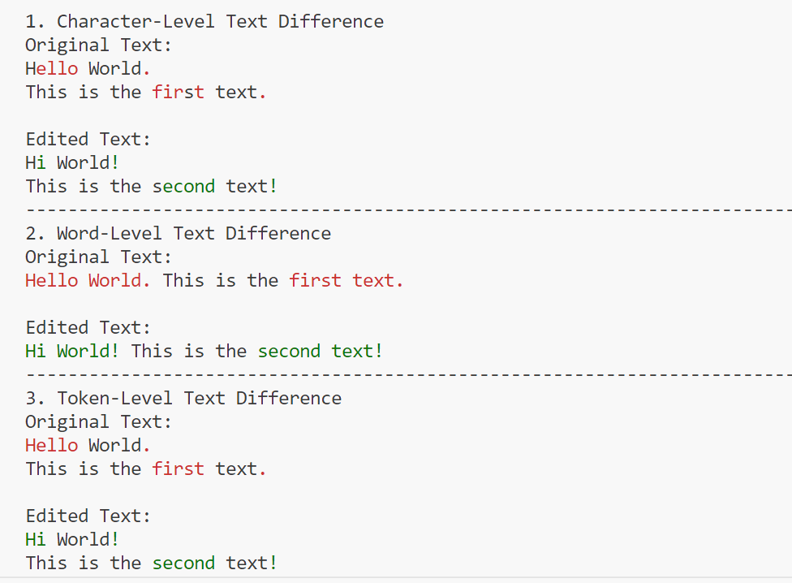

# text-token-diff
Difference comparison at the token level for texts

## Sample examples
Here we show the difference among
1. Character-level text difference.
2. Word-level text difference (Here, words are elementes that are splited by whitespaces). Limitation: Punctuation is usually attached to the preceding word.
3. Token-level text difference
